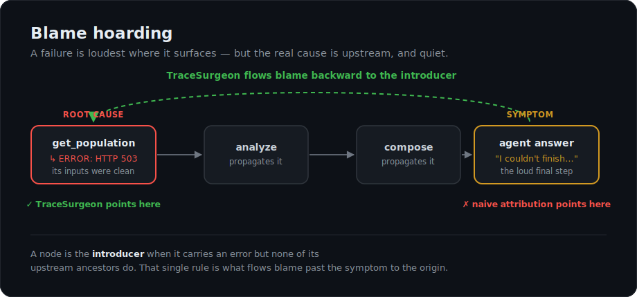
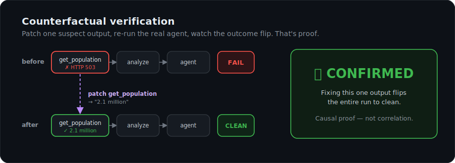
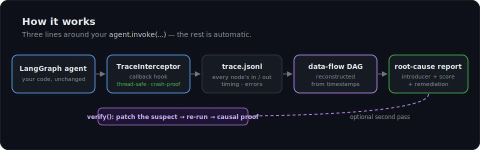

<div align="center">

# TraceSurgeon

### Causal, dependency-aware root-cause debugging for LangGraph agents

When an agent fails, find the node that **caused** it — not the one that **shows** it — and prove it.

[](https://github.com/ahhbhishek/tracesurgeon/actions/workflows/ci.yml)


</div>

---

When an agent gives a bad answer, the failure is loudest at the **final reasoning step** — but the real cause is usually a quiet poisoned tool output several steps upstream. Standard tools blame the loud step. This is **blame hoarding**. TraceSurgeon flows blame *backward* through the agent's data-flow graph to the node that actually **introduced** the error, tells you how to fix it, and can **prove** the diagnosis by re-running the agent with that one output corrected.

```text
ROOT CAUSE
  node:     tool:get_population   (confidence 100%)
  when:     2026-06-25T02:36:30Z
  why:      INTRODUCED the error (inputs were clean), errored tool call
  input:    {'city': 'Paris'}
  output:   "ERROR: census API returned HTTP 503, data unavailable"
  fix →     Upstream service error (5xx / overloaded). Retry with backoff.  (upstream_5xx)
  symptom:  surfaced at agent      ← where a naive tool would have blamed
```

---

## The problem: blame hoarding

<p align="center">
  
</p>

A tool returns a 503. Three nodes later, the model says *"I couldn't finish."* Every attribution signal — log-probability, recency, linguistic correlation — points at that **final** step, because that's where the error is loudest. But fixing the final step does nothing: the cause was the **first** tool.

**The insight:** a node is the **introducer** when it carries an error but *none of its upstream ancestors do*. That single rule, applied over the reconstructed data-flow graph, is what flows blame past the symptom to the origin.

## Quickstart

### 1. Install

Requires **Python 3.10+**. Clone the repo and install it:

```bash
git clone https://github.com/ahhbhishek/tracesurgeon.git
cd tracesurgeon
pip install -e .          # installs the library + the `tracesurgeon` CLI
```

> Tip: use a fresh virtual environment first — `python -m venv .venv && source .venv/bin/activate` (on Windows: `.venv\Scripts\activate`).

### 2. Check it works

Run the bundled example. It uses a tiny built-in agent, so **no API key is needed**:

```bash
python examples/quickstart.py
```

You should see a root-cause report ending with a green **`✅ CONFIRMED`** — if you do, your install is good.

### 3. Use it on your own agent

Three lines around your existing `agent.invoke(...)`:

```python
from tracesurgeon import instrument, diagnose

inst = instrument()                          # 1. make a tracer
agent.invoke(inputs, config=inst.config)     # 2. run YOUR agent as normal
diagnose(inst.path).print()                  # 3. get the root-cause report
```

Here `agent` and `inputs` are your own. `config=inst.config` only adds a callback handler — it changes nothing about how your agent runs. Works with any LangGraph agent (custom `StateGraph`, `create_react_agent`, sync or async). The full runnable example lives in [`examples/quickstart.py`](examples/quickstart.py).

## Proof, not correlation

Diagnosis tells you which node *correlates* with the failure. **Verification proves it** — it re-runs your agent with the suspect tool's output replaced by a corrected value. If the failure disappears when (and only when) you fix that one output, the link is causal.

<p align="center">
  
</p>

```python
diag = diagnose(inst.path)                                  # "tool:get_population looks guilty"
proof = diag.verify(
    lambda config: agent.invoke(inputs, config=config),     # re-runnable thunk
    replacement="Paris: 2.1 million",                       # the corrected output
)
proof.print()   # ✅ CONFIRMED — fixing this one output flips the run to clean.
```

Verdicts: **CONFIRMED** · **PARTIAL** (original cause gone, a new one surfaced) · **NOT_CONFIRMED** (still fails the same way → wrong hypothesis) · **INCONCLUSIVE**.

### Silent failures — the bug nothing else catches

The hardest real failure: a tool returns *plausible-but-wrong* data — a bad exchange rate, a stale number — with **no error string at all**. Detection honestly finds nothing. Prove it anyway with a `check=` predicate on the result:

```python
diag = diagnose(inst.path)        # "no failure detected" — there's genuinely no error to see

proof = diag.verify(
    lambda config: agent.invoke(inputs, config=config),
    replacement="92.0",           # the corrected tool output
    tool="usd_to_eur",
    check=lambda result: "92" in result["messages"][-1].content,   # is the answer right now?
)
# ✅ CONFIRMED — patching this one output makes the result correct.
#    Causal proof of a SILENT failure (no error markers to detect).
```

This is the capability the field's attribution tools lack: proving causation when there is nothing to detect.

## Validated live on a real LLM

Run against `openai/gpt-oss-20b` (via OpenRouter) driving a real `create_react_agent` — a real model making real tool-calling decisions, not a script:

| Scenario | Result |
|---|---|
| **5-tool financial pipeline**, early tool errors | blamed the **origin** (`get_cost`), not the 3 downstream propagators |
| **Silent wrong currency conversion** (no error markers) | detection clean; `check=` **proved** `usd_to_eur` causally |
| **Two independent poisoned tools** | **both** flagged |
| **Real provider errors** (429 quota / 401 auth / 404 bad-model) | each caught and correctly categorised |
| **Poisoned tool, model retried 9×** then masked it with a plausible answer | surfaced the **hidden** failure the user would never have seen → `verify` **CONFIRMED** |

Full captured transcripts in **[docs/PROOF.md](docs/PROOF.md)**. Reproduce with [`tests/test_complex_live.py`](tests/test_complex_live.py) (needs `OPENROUTER_API_KEY`).

<details>
<summary><b>See a real run — root cause + counterfactual proof</b></summary>

```text
──────────────────── TraceSurgeon — Root Cause Report ────────────────────
  trace: run_live_real.jsonl   steps: 12   tools: 7   total: 53.45ms

  ROOT CAUSE
    node:     tool:get_population  (confidence 100%)
    why:      INTRODUCED the error (inputs were clean), errored tool call,
              output contains error signal
    input:    {'city': 'Paris'}
    output:   "ERROR: census API returned HTTP 503, data unavailable"
    fix →     Upstream service error (5xx / overloaded). Retry with backoff. (upstream_5xx)
    symptom:  surfaced at agent

══════════════════ TraceSurgeon — Counterfactual Verification ══════════════
  patched output:  tool:get_population = '2.1 million'
  before:  FAIL    root cause = tool:get_population
  after:   clean   (no failure)

  ✅ CONFIRMED — fixing this one output flips the run to clean.
     This is causal proof, not correlation.
```

</details>

## How it works

<p align="center">
  
</p>

1. **Capture** — a thread-safe, crash-proof callback records every node/tool/LLM event to a `.jsonl`.
2. **Reconstruct** — `build_dataflow_dag()` rebuilds the *data-flow* graph from timestamps (robust to LangGraph's dual-layer events, loops, and parallel branches).
3. **Attribute** — `run_blame_analysis()` finds the **introducer** and ranks suspects.
4. **Remediate** — each failure is categorised (rate_limit, timeout, auth, upstream_5xx, bad_data, …) with a concrete fix hint.
5. **Prove** *(optional)* — `verify()` patches the suspect's output and re-runs the real agent.

Deep dive: **[docs/DESIGN.md](docs/DESIGN.md)**.

## Why not just…?

| Approach | What it gives you | The gap |
|---|---|---|
| **LangSmith / Phoenix** (observability) | records traces, latency, tokens | shows you *what happened*, not *which step caused the failure* |
| **LLM-as-judge** over the log | a plausible-sounding verdict | <10% accuracy on long multi-step logs; no causal grounding |
| **Single-response attribution** (e.g. ContextCite) | which context span influenced one output | blind to multi-step agent graphs and tool dependencies |
| **TraceSurgeon** | the **introducer** node, scored, with remediation — and **causal proof** via re-execution | patches tool outputs (v1); `llm:`/graph-node causes need an explicit `tool=` |

## Production-hardened

- **Thread-safe** — concurrent / parallel / async (`ainvoke`) runs never corrupt the trace (verified: 400 events across 8 threads, 0 corruption).
- **Crash-proof** — the interceptor can never crash your agent; an un-serializable payload degrades to `<unserializable>` and the run finishes.
- **Resilient analysis** — corrupted or truncated traces (agent died mid-write) are parsed best-effort, not fatally.
- **Comprehensive error detection** — tuned against real OpenAI / Anthropic / HTTP / network / stdlib / database / infra errors, with negation-awareness so *"no errors"* / *"timeout handling"* don't false-trigger (100% recall + precision on a 75-case corpus).

## CLI

```bash
tracesurgeon debug [trace.jsonl]          # root-cause report (default: newest trace)
tracesurgeon debug --json [trace.jsonl]   # machine-readable JSON (pipe to jq / use in CI)
tracesurgeon list  [--dir traces]         # all traces + clean/failure status
tracesurgeon show  [trace.jsonl]          # raw execution tree (no scoring)
```

`debug` exits non-zero when a failure is detected, so it drops straight into CI.


## Run the tests

```bash
python tests/run_all.py        # full offline suite (9 asserting suites)
```

## Layout

```
tracesurgeon/
  interceptor.py    # LangGraph callback → trace events (thread-safe, crash-proof)
  trace.py          # TraceEvent + TraceSession (atomic jsonl writer)
  dag.py            # call-tree + timestamp data-flow graph builders
  scorer.py         # failure detection + blame ranking (the introducer rule)
  report.py         # remediation taxonomy + JSON report + unified renderer
  counterfactual.py # patch a tool output, re-run, prove causation
  api.py            # instrument() / diagnose() / Diagnosis.verify() — public surface
  cli.py            # the `tracesurgeon` command
examples/quickstart.py
docs/DESIGN.md · docs/PROOF.md
tests/run_all.py
```

## License

MIT — see [LICENSE](LICENSE).

<div align="center"><sub>Built to make autonomous agents debuggable. Find the cause, not the symptom.</sub></div>
